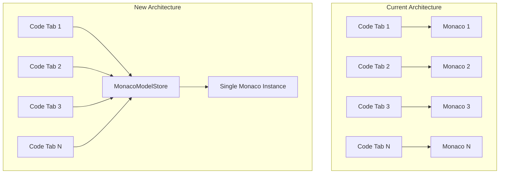

# Monaco Singleton Refactor (Simplified Approach)

## Problem

Currently, each open code tab mounts its own Monaco editor instance. With 20 code files open, you have 20 Monaco instances consuming 300-1000 MB of memory.

## Solution

Keep only Monaco as a singleton (1 instance + N models). All other viewers remain unchanged.



## What Changes vs What Stays the Same

| Component         | Change? | Notes                            |
| ----------------- | ------- | -------------------------------- |
| Monaco            | Yes     | Single instance + model swapping |
| Milkdown          | No      | Stays as N instances             |
| Video/Audio       | No      | Stays as N instances             |
| Image/PDF         | No      | Stays as N instances             |
| FileTabsContainer | No      | Still renders N FileViewerTab    |
| FileViewerTab     | Minor   | Pass filePath to Monaco          |

## Memory Impact

| Scenario          | Current      | After                   |
| ----------------- | ------------ | ----------------------- |
| 20 code files     | ~300-1000 MB | ~50-100 MB              |
| 20 markdown files | ~200-400 MB  | ~200-400 MB (unchanged) |
| 20 mixed tabs     | ~400-800 MB  | ~150-300 MB             |

## Files to Modify

| File                                                                                                                    | Change                                     |
| ----------------------------------------------------------------------------------------------------------------------- | ------------------------------------------ |
| [MonacoCodeEditor.tsx](apps/application-dashboard/src/modules/pace/components/file-viewer/viewers/MonacoCodeEditor.tsx) | Refactor to use model swapping             |
| [FileViewerTab.tsx](apps/application-dashboard/src/modules/pace/components/file-viewer/FileViewerTab.tsx)               | Pass filePath instead of content to Monaco |
| [useDynamicTabs.ts](apps/application-dashboard/src/modules/pace/hooks/useDynamicTabs.ts)                                | Add model cleanup on tab close             |

## New File to Create

| File                  | Purpose                                              |
| --------------------- | ---------------------------------------------------- |
| `MonacoModelStore.ts` | Singleton store managing Monaco models per file path |

---

## Implementation Details

### Step 1: Create MonacoModelStore

Location: `apps/application-dashboard/src/modules/pace/stores/MonacoModelStore.ts`

```typescript
import type { Monaco } from '@monaco-editor/react';
import type { editor } from 'monaco-editor';

interface MonacoModelEntry {
  model: editor.ITextModel;
  viewState: editor.ICodeEditorViewState | null;
}

class MonacoModelStoreClass {
  private models = new Map<string, MonacoModelEntry>();
  private monaco: Monaco | null = null;

  setMonaco(monaco: Monaco) {
    this.monaco = monaco;
  }

  getOrCreateModel(filePath: string, content: string, language: string): editor.ITextModel {
    const existing = this.models.get(filePath);
    if (existing) {
      return existing.model;
    }

    if (!this.monaco) {
      throw new Error('Monaco not initialized');
    }

    const uri = this.monaco.Uri.parse(`file://${filePath}`);
    const model = this.monaco.editor.createModel(content, language, uri);

    this.models.set(filePath, { model, viewState: null });
    return model;
  }

  getModel(filePath: string): editor.ITextModel | null {
    return this.models.get(filePath)?.model ?? null;
  }

  saveViewState(filePath: string, viewState: editor.ICodeEditorViewState | null) {
    const entry = this.models.get(filePath);
    if (entry) {
      entry.viewState = viewState;
    }
  }

  getViewState(filePath: string): editor.ICodeEditorViewState | null {
    return this.models.get(filePath)?.viewState ?? null;
  }

  disposeModel(filePath: string) {
    const entry = this.models.get(filePath);
    if (entry) {
      entry.model.dispose();
      this.models.delete(filePath);
    }
  }

  updateModelPath(oldPath: string, newPath: string) {
    const entry = this.models.get(oldPath);
    if (entry) {
      this.models.delete(oldPath);
      this.models.set(newPath, entry);
    }
  }

  updateContent(filePath: string, content: string) {
    const entry = this.models.get(filePath);
    if (entry && entry.model.getValue() !== content) {
      entry.model.setValue(content);
    }
  }
}

export const MonacoModelStore = new MonacoModelStoreClass();
```

### Step 2: Refactor MonacoCodeEditor

Current props:

```typescript
interface MonacoCodeEditorProps {
  content: string;
  language?: string;
  onChange?: (value: string) => void;
  readOnly?: boolean;
}
```

New props:

```typescript
interface MonacoCodeEditorProps {
  filePath: string;
  content: string; // Initial content for model creation
  language?: string;
  onChange?: (value: string) => void;
  readOnly?: boolean;
}
```

Key changes in component:

1. On mount: Initialize Monaco in store, get/create model
2. On `filePath` change: Save view state of old file, load model of new file, restore view state
3. Use `editor.setModel()` instead of `value` prop
4. Listen to model's `onDidChangeContent` for onChange callback

```typescript
const MonacoCodeEditor = ({ filePath, content, language, onChange, readOnly }: MonacoCodeEditorProps) => {
  const editorRef = useRef<editor.IStandaloneCodeEditor | null>(null);
  const previousFilePathRef = useRef<string | null>(null);

  const handleEditorDidMount: OnMount = useCallback(
    (editor, monaco) => {
      MonacoModelStore.setMonaco(monaco);
      editorRef.current = editor;

      // Get or create model for this file
      const model = MonacoModelStore.getOrCreateModel(filePath, content, language);
      editor.setModel(model);

      // Restore view state if exists
      const viewState = MonacoModelStore.getViewState(filePath);
      if (viewState) {
        editor.restoreViewState(viewState);
      }

      previousFilePathRef.current = filePath;
      editor.focus();
    },
    [filePath, content, language],
  );

  // Handle file path changes (tab switching)
  useEffect(() => {
    const editor = editorRef.current;
    if (!editor || !previousFilePathRef.current) return;
    if (previousFilePathRef.current === filePath) return;

    // Save view state of previous file
    const viewState = editor.saveViewState();
    MonacoModelStore.saveViewState(previousFilePathRef.current, viewState);

    // Load model for new file
    const model = MonacoModelStore.getOrCreateModel(filePath, content, language);
    editor.setModel(model);

    // Restore view state of new file
    const newViewState = MonacoModelStore.getViewState(filePath);
    if (newViewState) {
      editor.restoreViewState(newViewState);
    }

    previousFilePathRef.current = filePath;
    editor.focus();
  }, [filePath, content, language]);

  // ... rest of component
};
```

### Step 3: Update FileViewerTab

Pass `filePath` to MonacoCodeEditor:

```typescript
// Before
case FILE_CATEGORY.CODE:
  return (
    <MonacoCodeEditor
      content={content || ''}
      language={getMonacoLanguage(fileExtension)}
      onChange={onContentChange}
    />
  );

// After
case FILE_CATEGORY.CODE:
  return (
    <MonacoCodeEditor
      filePath={filePath}
      content={content || ''}
      language={getMonacoLanguage(fileExtension)}
      onChange={onContentChange}
    />
  );
```

Same for HTML code mode and Markdown raw mode.

### Step 4: Cleanup on Tab Close

In `useDynamicTabs.ts`, dispose model when tab closes:

```typescript
import { MonacoModelStore } from '@/modules/pace/stores/MonacoModelStore';

const closeTab = useCallback(
  (e: React.MouseEvent, id: string) => {
    // ... existing code ...

    // Dispose Monaco model
    MonacoModelStore.disposeModel(closingTab.id);

    // ... rest of existing code ...
  },
  [
    /* deps */
  ],
);
```

### Step 5: Handle File Rename/Move

In `useDynamicTabs.ts`, update model path on rename:

```typescript
const updateTab = useCallback(
  (oldPath: string, newPath: string, newName: string) => {
    // ... existing code ...

    // Update Monaco model path
    MonacoModelStore.updateModelPath(oldPath, newPath);

    // ... rest of existing code ...
  },
  [
    /* deps */
  ],
);
```

---

## UX Impact

| Scenario            | Before        | After                     |
| ------------------- | ------------- | ------------------------- |
| Code → Code switch  | Instant       | ~50ms (model swap)        |
| Code undo history   | Preserved     | Preserved                 |
| Markdown → Markdown | Instant       | Instant (unchanged)       |
| Markdown undo       | Preserved     | Preserved (unchanged)     |
| Video/Audio         | Stays mounted | Stays mounted (unchanged) |

**Minimal UX change** - only code tab switching has a micro-delay (~50ms).

---

## Testing Checklist

- Open 20+ code files, verify memory stays low (~50-100MB vs ~300-1000MB)
- Switch between code tabs, verify cursor position preserved
- Switch between code tabs, verify scroll position preserved
- Switch between code tabs, verify undo history preserved
- Edit code, switch tab, switch back, verify changes still there
- Rename file while tab is open, verify editing continues
- Close code tab, verify no memory leak (model disposed)
- Markdown/Video/Audio tabs work exactly as before
