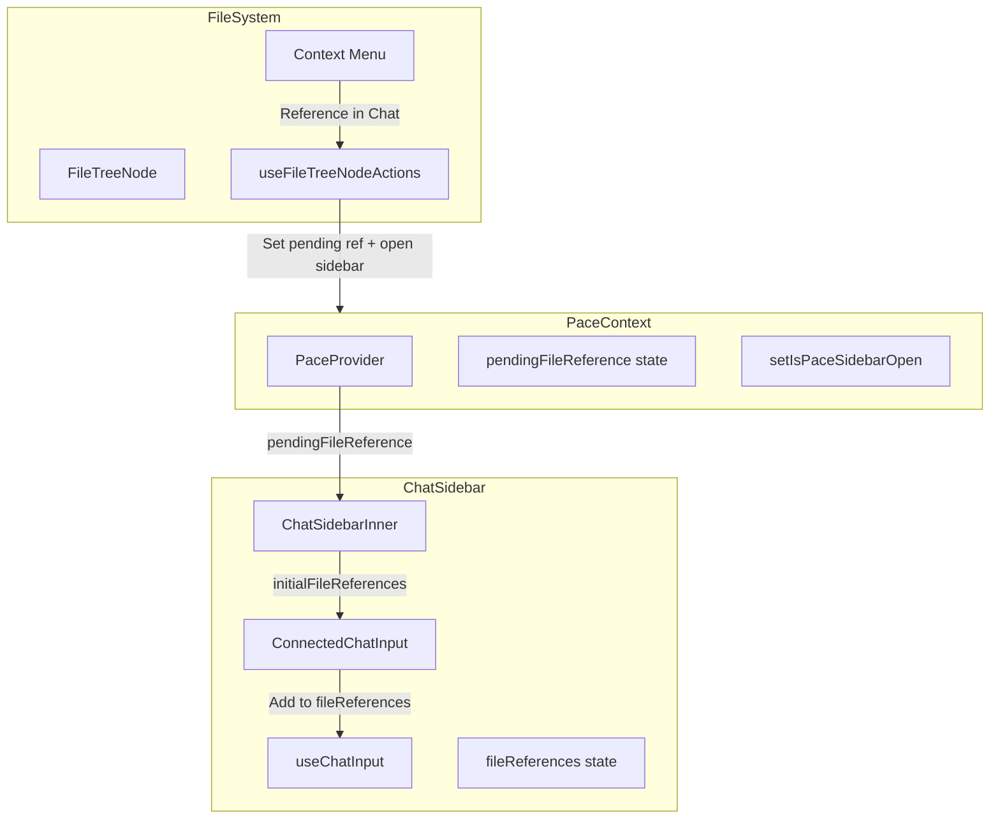

# Add "Reference in Chat" Feature to File System Context Menu

## Overview

Add a context menu option in the file system that allows users to reference a file in the chat sidebar. When clicked, it will:

1. Open the chat sidebar
2. Add the file as a reference pill in the chat input
3. Allow removal of the reference before submission
4. Include the file reference in the message payload when submitted

## Architecture



## Key Files to Modify

### 1. Add Context Menu Action Constant

**File:** `[apps/application-dashboard/src/modules/pace/components/files/files.constants.ts](apps/application-dashboard/src/modules/pace/components/files/files.constants.ts)`

- Add `REFERENCE_IN_CHAT: 'reference-in-chat'` to `CONTEXT_MENU_ACTION_IDS`
- Add new action to `CONTEXT_MENU_ACTIONS` array with `MessageSquare` icon and `fileOnly: true`

### 2. Extend PaceContext for File References

**File:** `[apps/application-dashboard/src/modules/pace/pace.context.tsx](apps/application-dashboard/src/modules/pace/pace.context.tsx)`

- Add `pendingFileReference` state to hold the file reference to pass to chat
- Add `setPendingFileReference` setter function
- Add `clearPendingFileReference` function to clear after consumption

### 3. Handle Context Menu Action

**File:** `[apps/application-dashboard/src/modules/pace/hooks/useFileTreeNodeActions.ts](apps/application-dashboard/src/modules/pace/hooks/useFileTreeNodeActions.ts)`

- Add case for `REFERENCE_IN_CHAT` action
- Call `setPendingFileReference` with file path and name
- Call `setIsPaceSidebarOpen(true)` to open the chat sidebar

### 4. Consume Pending File Reference in Chat Sidebar

**File:** `[apps/application-dashboard/src/modules/pace/components/layout/chat-sidebar/ChatSidebarInner.tsx](apps/application-dashboard/src/modules/pace/components/layout/chat-sidebar/ChatSidebarInner.tsx)`

- Get `pendingFileReference` and `clearPendingFileReference` from `usePaceContext`
- Pass `initialFileReferences` prop to `ConnectedChatInput`
- Clear pending reference after it's consumed

### 5. Support Initial File References in ConnectedChatInput

**File:** `[packages/chat/src/components/ConnectedChatInput.tsx](packages/chat/src/components/ConnectedChatInput.tsx)`

- Add `initialFileReferences` prop
- Pass it to `useChatInput` hook

### 6. Handle Initial File References in useChatInput

**File:** `[packages/chat/src/hooks/useChatInput.ts](packages/chat/src/hooks/useChatInput.ts)`

- Add `initialFileReferences` to props interface
- Add `addFileReferences` function to add external file references
- Initialize `fileReferences` state with initial values when provided
- Modify `removeFileReference` to NOT call delete API for externally referenced files (they weren't uploaded via chat)

## Data Flow

1. User right-clicks file -> selects "Reference in Chat"
2. `useFileTreeNodeActions` sets `pendingFileReference` in `PaceContext` and opens sidebar
3. `ChatSidebarInner` reads `pendingFileReference`, passes to `ConnectedChatInput`
4. `useChatInput` adds the reference to `fileReferences` state (without uploading)
5. File appears as a pill in `ChatComposer` via `FileReferencesList`
6. User can remove the pill (reference removed from state, no API delete call)
7. On submit, file reference is included in `message_content.file_references`

## File Reference Type

The existing `UploadedFile` type will be used:

```typescript
interface UploadedFile {
  path: string; // File path in filesystem
  name: string; // Display name
  file_type: string; // MIME type (can be empty for references)
  file: File; // File object (not needed for references)
}
```

For external references, we'll create entries with `path` and `name` populated, but `file_type` as empty string and `file` as a dummy File object.
