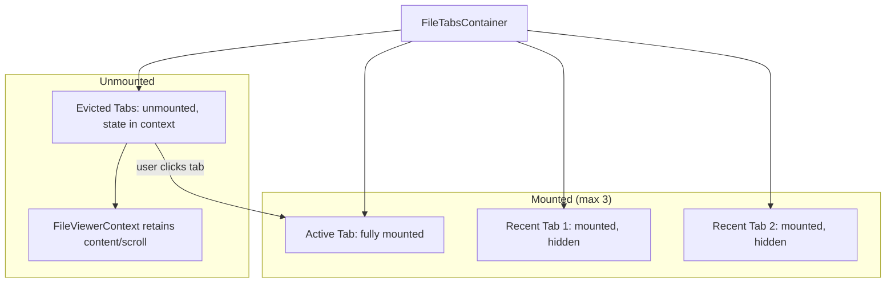

# Fix File Viewer Performance Freezes

## Problem

All file viewer tabs stay mounted via CSS visibility toggling in [FileTabsContainer.tsx](apps/application-dashboard/src/modules/pace/components/file-viewer/FileTabsContainer.tsx). Every open file retains its full viewer instance (Monaco editor, Milkdown/ProseMirror, XLSX workbook + parsed rows, PDF document, DOCX rendered DOM, PPTX renderer, iframe with scripts). With many tabs open, this compounds into multi-hundred-MB memory usage and main-thread contention, causing Chrome's "Page Unresponsive" dialog.

## Per-Viewer Issues Found

| Viewer                        | Severity | Issues                                                                                                                                                                           |
| ----------------------------- | -------- | -------------------------------------------------------------------------------------------------------------------------------------------------------------------------------- |
| **SpreadsheetViewer**         | Critical | `XLSX.read()` + `sheet_to_json()` block main thread; full workbook + all rows held in state; no worker                                                                           |
| **MilkdownEditor**            | High     | Full Crepe/ProseMirror instance per tab; polling can trigger `replaceAll` re-renders; no explicit destroy                                                                        |
| **MonacoCodeEditor**          | High     | N editors alive simultaneously; `automaticLayout: true` runs layout measurements on hidden editors; `editor.focus()` on mount; CDN version mismatch (0.49 runtime vs 0.52 types) |
| **PdfViewer**                 | High     | Full PDF.js document + canvas per tab; no explicit teardown; cleanup depends entirely on `@pdfslick/react` unmount                                                               |
| **DocxViewer**                | Medium   | Full document HTML + styles rendered into DOM; no explicit cleanup of `innerHTML` or library internals on unmount                                                                |
| **PresentationViewer**        | Low      | Has proper cleanup (`destroy()`, `abort()`, `ResizeObserver.disconnect()`); still retains rendered slides while mounted                                                          |
| **HtmlPreviewViewer**         | Medium   | iframe with `sandbox='allow-scripts'` — scripts keep running in background tabs                                                                                                  |
| **VideoViewer / AudioViewer** | Low      | Properly pause on `isActive=false`; listeners cleaned up on unmount                                                                                                              |
| **ImageViewer**               | Low      | Lightweight; no cleanup issues                                                                                                                                                   |

## Architecture Change: Hybrid Tab Strategy

The current approach mounts all tabs to preserve scroll position and editor state. A full unmount would lose that state. The fix uses a **hybrid approach**: keep lightweight state cached in context, but only mount the **active viewer + N most-recent viewers** (LRU).

## Implementation Plan

### 1. Add LRU tab mounting limit in FileTabsContainer

**File:** [FileTabsContainer.tsx](apps/application-dashboard/src/modules/pace/components/file-viewer/FileTabsContainer.tsx)

- Track the N most recently active tab keys (e.g., `MAX_MOUNTED_TABS = 3`)
- Only render `FileViewerTab` for tabs in the mounted set
- For evicted tabs, render nothing (their state is already preserved in `FileViewerContext` for editable files)
- When a user switches to an evicted tab, it re-mounts and restores from context

### 2. Move XLSX parsing to a Web Worker

**New file:** `viewers/spreadsheet/spreadsheet.worker.ts`
**Modified:** [SpreadsheetViewer.tsx](apps/application-dashboard/src/modules/pace/components/file-viewer/viewers/spreadsheet/SpreadsheetViewer.tsx)

- Create a dedicated worker that receives an `ArrayBuffer` or string and returns `{ headers, rows, sheetNames }`
- Use `Comlink` or raw `postMessage` to communicate
- This unblocks the main thread during `XLSX.read()` + `sheet_to_json()`
- Release the workbook inside the worker after parsing; only send serialized rows back
- For sheet switching, re-parse from the cached buffer in the worker (avoids holding the full `WorkBook` in main thread state)

### 3. Add explicit cleanup to heavy viewers on unmount

**Files to modify:**

- [MilkdownEditor.tsx](apps/application-dashboard/src/modules/pace/components/file-viewer/viewers/MilkdownEditor.tsx) — call `crepe.destroy()` in a `useEffect` cleanup (verify `@milkdown/react` v7.18 does this automatically; if not, add it)
- [DocxViewer.tsx](apps/application-dashboard/src/modules/pace/components/file-viewer/viewers/DocxViewer.tsx) — clear `containerRef.innerHTML` and `styleRef.innerHTML` in the effect cleanup
- [SpreadsheetViewer.tsx](apps/application-dashboard/src/modules/pace/components/file-viewer/viewers/spreadsheet/SpreadsheetViewer.tsx) — null out `workbookRef` and `spreadsheetData` on unmount (helps GC before React drops state)

### 4. Pause inactive Monaco editors

**File:** [MonacoCodeEditor.tsx](apps/application-dashboard/src/modules/pace/components/file-viewer/viewers/MonacoCodeEditor.tsx)

- Accept `isActive` prop
- When `isActive` becomes false, call `editor.updateOptions({ readOnly: true })` and potentially `editor.getModel()?.onDidChangeContent` cleanup to reduce background work
- Alternatively, since the LRU strategy (step 1) will unmount most inactive editors, this becomes less critical but still a good defense

### 5. Fix Monaco lazy-loading leak

**File:** [FileViewerContent.tsx](apps/application-dashboard/src/modules/pace/components/file-viewer/FileViewerContent.tsx)

- The static import `import { getMonacoLanguage } from './viewers/MonacoCodeEditor'` defeats code-splitting by pulling the entire Monaco module into the parent chunk
- Extract `getMonacoLanguage` into a separate tiny utility file (e.g., `viewers/monaco.utils.ts`) and import from there instead

### 6. Fix HtmlPreviewViewer background script execution

**File:** [HtmlPreviewViewer.tsx](apps/application-dashboard/src/modules/pace/components/file-viewer/viewers/HtmlPreviewViewer.tsx)

- When `isActive` is false (needs to be threaded through), set `srcDoc` to empty or remove the iframe to stop script execution in background tabs
- Or rely on the LRU unmounting from step 1

## Priority Order

1. **LRU tab mounting** (step 1) — biggest impact, fixes all viewers at once
2. **XLSX Web Worker** (step 2) — fixes the main-thread blocking freeze
3. **Explicit cleanup** (step 3) — ensures memory is released promptly
4. **Monaco `getMonacoLanguage` extraction** (step 5) — quick win for bundle size
5. **Monaco inactive pause** (step 4) — defense in depth
6. **HTML iframe cleanup** (step 6) — minor, mostly covered by step 1
