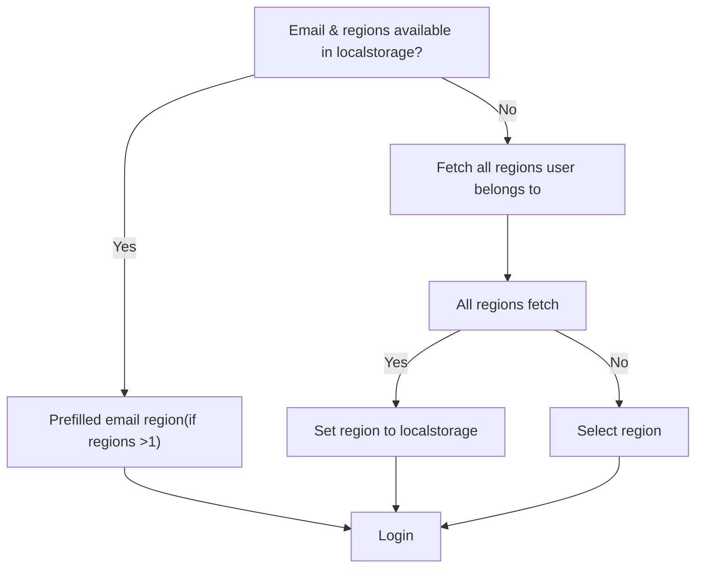

link

https://www.notion.so/zampfinance/Multi-Region-Organization-Switcher-Implementation-Document-225edc94e67f80c6856adf50078ba3d8

## 📌 Overview

This document outlines the implementation of the **Organization Switcher with Multi-Region**. Users can seamlessly switch between organizations across regions (Default(US), Singapore, Middle East for now), and switch organization while ensuring consistent authentication and secure session management.

## 🧩 Key Components

### 🔹 1. Region Detection & API Domain Management

- **Path**: `packages/api/api.utils.ts`
- **Functions**:
  - `getApiDomainByRegion()`: Returns active regions for user
  - `reinitializeApiDomain()`: Updates base API domain based on selected region

### 🔹 2. `LoginForm` (Enhanced)

- **Path**: /application-dashboard/src/modules/login/LoginForm.tsx
- **Enhancements**:
  - Detect all current regions in localstorage.
  - Detects the current region using the hostname.
  - On more than 1 regions, show region select dropdown.
  - on null regions, fetch all regions and set to localstorage.
  - if only single region available, login
  - if multiple regions available, land to select region dropdown

### 🔹 3. **OrgSwitcher.tsx** (New)

- **Path**: apps/application-dashboard/src/components/layouts/dashboard-layout/components/OrgSwitcher.tsx
- **Updates**:
  - Get all orgnizations from default region.
  - get orgnization from localstorage and show default.
  - on org switch update localstorage and reload dashboard.

## 🧠 System Flow Diagram

## 📌 Implementation Steps for Login

1. **Already sign in user.**
   1. get email from localstorage.
   2. call **getApiDomainByRegion**
   3. get all regions from local storage.
   4. get selected region from localstoreage.
   5. if All regions > 1 show select region dropdown.
   6. user click login → login.
2. User sign in for first time.
   1. call **`getApiDomainByRegion`.**
   2. get All regions user belongs to.
   3. 1 regions, set first as default region.
   4. if all regions fetched(200/404) set all regions with default to localstorage.
   5. if user belongs to single region, initiate login flow.
   6. if user belong to multiple regions, show region select dropdown.

## 📌 Implementation Steps for org

1. Get all organizations in selected region with `organizations/`
2. if organization is selected get from localstorage.
3. if no default orgnization selected, set to localstorage.
4. on orginzation change, update org in localstorage.
5. refresh the dashboard with default org.
