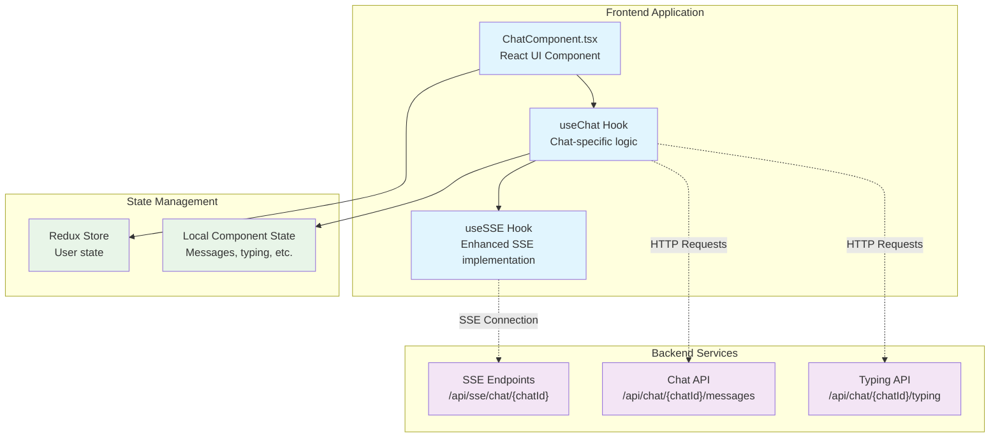

# SSE Chat Framework - Implementation Documentation

## Overview

This document describes the implementation of the SSE-based chat framework for the Zamp Platform, designed to provide real-time messaging capabilities for commenting systems and chatbot interactions.

## Architecture Overview

### High-Level Architecture



### Component Hierarchy

```
packages/utils/src/
├── hooks/
│   └── useChat.ts             # Chat-specific functionality
├── types/
│   └── chat.types.ts          # TypeScript interfaces
├── utils/
│   └── chatHelpers.ts         # Utility functions
└── index.ts                   # Package exports

apps/application-dashboard/src/components/chat/
├── ChatComponent.tsx          # Example React component
└── index.ts                   # Component exports
```

## Core Components

### 1. useSSE Hook (Existing)

**Location**: `packages/utils/hooks/useSSE.ts`

The foundation SSE hook that handles:

- EventSource connection management
- Automatic reconnection with configurable intervals
- Idle timeout detection and reconnection
- Event listener management
- Resource cleanup

**Key Features**:

- Robust error handling and reconnection logic
- Configurable idle timeout (default: 60s)
- Support for custom event listeners
- Credential management for authenticated connections

### 2. useChat Hook (Chat Framework)

**Location**: `packages/utils/src/hooks/useChat.ts`

Builds on the enhanced `useSSE` hook to provide chat-specific functionality:

- Manual connection control (`connect()` / `disconnect()`)
- Enhanced state management
- Reconnection attempt tracking
- Chat-specific configuration

**Architecture Decision**: Instead of duplicating EventSource logic, this hook wraps the existing `useSSE` implementation using an `isActive` state to control when connections are established.

```typescript
// Key implementation pattern
const { close } = useSSE({
  url: isActive ? config.url : '', // Empty URL when inactive
  onMessage: handleMessage,
  onError: handleError,
  onOpen: handleOpen,
  withCredentials: config.options?.withCredentials ?? true,
  reconnectIntervalMs: config.reconnectInterval ?? 3000,
});
```

### 3. useChat Hook (Chat Logic)

**Location**: `packages/utils/src/hooks/useChat.ts`

Builds on the enhanced `useSSE` hook to provide chat-specific functionality:

- Message state management
- Typing indicator handling
- User presence tracking
- Message sending via HTTP API
- Event parsing and routing

**Message Flow**:

1. Receives SSE events via enhanced `useSSE` hook
2. Parses JSON payloads and routes by event type
3. Updates local state (messages, typing users, connected users)
4. Triggers optional callbacks for custom handling

### 4. ChatComponent (Example Implementation)

**Location**: `apps/application-dashboard/src/components/chat/ChatComponent.tsx`

A complete React component demonstrating framework usage:

- Message display with timestamps
- Input handling with keyboard shortcuts
- Connection status indicators
- Typing indicator display
- Integration with Redux for user state

## Technical Decisions

### 1. Wrapper Pattern vs. Direct Integration

**Decision**: Wrap existing `useSSE` hook instead of modifying it directly.

**Rationale**:

- Preserves existing functionality used by activity logs
- Maintains backward compatibility
- Allows chat-specific enhancements without affecting other use cases
- Follows single responsibility principle

### 2. State Management Strategy

**Decision**: Hybrid approach using local state + optional Redux integration.

**Local State** (via useState):

- Messages array
- Typing users
- Connected users
- Connection state

**Redux Integration**:

- User authentication state
- Global application state when needed

**Rationale**:

- Chat state is typically component-scoped
- Reduces Redux store complexity
- Allows framework to work without Redux dependency
- Enables easy integration when global state is needed

### 3. API Communication Pattern

**Decision**: Separate SSE for receiving + HTTP for sending.

**SSE (Server-Sent Events)**:

- Real-time message delivery
- Typing indicators
- User presence updates
- System notifications

**HTTP APIs**:

- Message sending (`POST /api/chat/{chatId}/messages`)
- Typing indicators (`POST /api/chat/{chatId}/typing`)
- Chat management operations

**Rationale**:

- SSE is unidirectional (server → client)
- HTTP provides reliable delivery confirmation for user actions
- Follows established patterns in the application
- Enables proper error handling for user actions

### 4. Type Safety Strategy

**Decision**: Comprehensive TypeScript interfaces with strict typing.

**Key Interfaces**:

```typescript
interface ChatMessage {
  id: string;
  content: string;
  timestamp: Date;
  sender: ChatUser;
  type: 'message' | 'system' | 'typing' | 'error';
  metadata?: Record<string, unknown>;
}

interface ChatConfig extends Omit<SSEConnectionConfig, 'onMessage'> {
  chatId: string;
  userId: string;
  onNewMessage?: (message: ChatMessage) => void;
  // ... other callbacks
}
```

**Rationale**:

- Prevents runtime errors through compile-time checking
- Improves developer experience with autocomplete
- Documents expected data structures
- Enables safe refactoring

## Integration Patterns

### 1. Redux Integration

```typescript
import { useAppSelector } from 'hooks/toolkit';
import { useChat } from '@zamp-platform/utils';

const MyComponent = () => {
  const user = useAppSelector((state: RootState) => state.user.user);

  const chat = useChat({
    url: `/api/sse/chat/${chatId}`,
    chatId,
    userId: user?.user_id || '',
    // ... configuration
  });
};
```

### 2. Authentication Integration

The framework automatically includes credentials in all requests:

- SSE connections use `withCredentials: true`
- HTTP requests use `credentials: 'include'`
- Integrates with existing authentication middleware

### 3. Error Handling Pattern

```typescript
// Connection-level errors
const chat = useChat({
  onError: (error) => {
    console.error('Connection error:', error);
    // Handle reconnection, show user notification, etc.
  },
});

// Message-level errors
try {
  await chat.sendMessage('Hello');
} catch (error) {
  // Handle send failures
  showErrorNotification('Failed to send message');
}
```

## Use Case Implementations

### 1. Commenting System

```typescript
const commentChat = useChat({
  url: `/api/sse/comments/${documentId}`,
  chatId: documentId,
  userId: currentUser.id,
  onNewMessage: (message) => {
    if (message.type === 'message') {
      // Add comment to document
      addCommentToDocument(message);
    }
  },
});

// Add comment
await commentChat.sendMessage('This looks great!', {
  type: 'comment',
  documentId,
  position: { x: 100, y: 200 }, // For positioned comments
});
```

### 2. Chatbot Integration

```typescript
const botChat = useChat({
  url: `/api/sse/chatbot/${sessionId}`,
  chatId: sessionId,
  userId: currentUser.id,
  onNewMessage: (message) => {
    if (message.sender.id === 'bot') {
      // Handle bot response
      displayBotMessage(message);

      // Parse bot actions
      if (message.metadata?.action) {
        executeBotAction(message.metadata.action);
      }
    }
  },
});

// Send user query
await botChat.sendMessage('Help me with payments', {
  type: 'user_query',
  context: 'payments_module',
  intent: 'help_request',
});
```

## Security Considerations

### 1. XSS Prevention

**Message Sanitization**:

```typescript
export const sanitizeMessage = (content: string): string => {
  return content
    .replace(/</g, '&lt;')
    .replace(/>/g, '&gt;')
    .replace(/"/g, '&quot;')
    .replace(/'/g, '&#x27;')
    .replace(/\//g, '&#x2F;');
};
```

**Mention Parsing** (with sanitization):

```typescript
export const parseMessageMentions = (content: string) => {
  const mentionRegex = /@(\w+)/g;
  return {
    content: content.replace(
      mentionRegex,
      (match, username) => `<span class="mention">@${sanitizeMessage(username)}</span>`,
    ),
    mentions: [...content.matchAll(mentionRegex)].map((m) => m[1]),
  };
};
```

### 2. Authentication & Authorization

- All SSE connections require authentication
- Chat access controlled by `chatId` permissions
- User identity verified on both client and server
- Message metadata includes sender verification

### 3. Input Validation

- Message content length limits
- Metadata structure validation
- User ID verification
- Rate limiting on typing indicators

## Performance Considerations

### 1. Connection Management

- Single SSE connection per chat instance
- Automatic cleanup on component unmount
- Reconnection with exponential backoff
- Idle timeout to prevent stale connections

### 2. State Optimization

- Message pagination for large chat histories
- Typing indicator debouncing (recommended)
- Efficient re-renders with React.memo and useCallback
- Local state for chat-specific data

### 3. Memory Management

- Automatic EventSource cleanup
- Timeout clearing on unmount
- Message history limits
- Garbage collection of old typing states

## Testing Strategy

### 1. Unit Tests

**useSSE Hook** (existing):

- Connection establishment
- Reconnection logic
- Event handling
- Cleanup behavior

**Enhanced useSSE Hook**:

- Manual connection control
- State management
- Connection lifecycle
- Error handling

**useChat Hook**:

- Message parsing
- State updates
- API integration

### 2. Integration Tests

- End-to-end message flow
- Multiple chat instances
- Authentication integration
- Error scenarios

### 3. Component Tests

- ChatComponent rendering
- User interactions
- State synchronization
- Error handling

## Monitoring & Observability

### 1. Connection Metrics

- Connection success/failure rates
- Reconnection frequency
- Message delivery latency
- Error categorization

### 2. Usage Analytics

- Active chat sessions
- Message volume per chat type
- User engagement patterns
- Feature adoption rates

### 3. Error Tracking

- Connection failures
- Message send failures
- Parse errors
- Authentication issues

## Future Enhancements

### 1. Planned Features

- **Message Reactions**: Emoji reactions to messages
- **File Attachments**: Support for file uploads in chat
- **Message Threading**: Reply-to-message functionality
- **Presence Indicators**: Online/offline status
- **Message Search**: Full-text search within chat history

### 2. Performance Optimizations

- **Message Virtualization**: For large chat histories
- **Connection Pooling**: Shared connections for multiple chats
- **Offline Support**: Queue messages when disconnected
- **Push Notifications**: Browser notifications for new messages

### 3. Developer Experience

- **Storybook Integration**: Component documentation
- **Testing Utilities**: Mock SSE providers
- **DevTools Extension**: Chat state debugging
- **Performance Profiler**: Connection and render metrics

## Migration Guide

### From Custom SSE Implementation

If migrating from a custom SSE implementation:

1. **Replace EventSource logic**:

   ```typescript
   // Before
   const eventSource = new EventSource(url);

   // After
   const connection = useSSE({ url, autoConnect: false });
   ```

2. **Update state management**:

   ```typescript
   // Before
   const [messages, setMessages] = useState([]);

   // After
   const chat = useChat({ chatId, userId });
   // Messages available as chat.messages
   ```

3. **Migrate event handlers**:

   ```typescript
   // Before
   eventSource.onmessage = (event) => {
     /* handle */
   };

   // After
   const chat = useChat({
     onNewMessage: (message) => {
       /* handle */
     },
   });
   ```

### From WebSocket Implementation

If migrating from WebSocket:

1. **Connection pattern**:
   - WebSocket: Bidirectional, single connection
   - SSE + HTTP: Unidirectional SSE + HTTP for sending

2. **Message sending**:

   ```typescript
   // Before (WebSocket)
   websocket.send(JSON.stringify(message));

   // After (SSE + HTTP)
   await chat.sendMessage(content, metadata);
   ```

3. **Event handling**:
   - Similar patterns, but SSE is server-initiated only
   - Client actions use HTTP APIs

## Conclusion

The SSE chat framework provides a robust, scalable solution for real-time messaging in the Zamp Platform. By building on the existing `useSSE` infrastructure, it maintains consistency with established patterns while adding chat-specific functionality.

The architecture supports both commenting and chatbot use cases, with clear separation of concerns and comprehensive error handling. The framework is designed for extensibility, allowing future enhancements without breaking existing implementations.

Key benefits:

- **Reusability**: Works across different chat contexts
- **Reliability**: Built on proven SSE infrastructure
- **Type Safety**: Comprehensive TypeScript support
- **Performance**: Optimized for real-time communication
- **Security**: XSS prevention and authentication integration
- **Maintainability**: Clear architecture and documentation

The implementation successfully eliminates code duplication while providing enhanced functionality for chat-specific use cases, making it a valuable addition to the platform's real-time communication capabilities.
